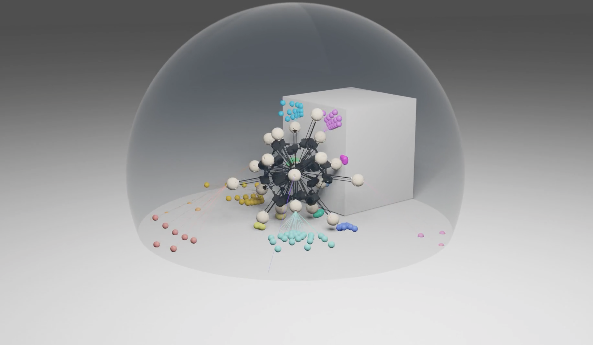

# Extreme Symmetry Enables Omnidirectional and Multifunctional Robotics

### [Jiaxun Liu*](https://jiaxunliu.com), [Boxi Xia*](https://boxixia.github.io/), [Boyuan Chen](http://boyuanchen.com/) 
Duke University, * These authors contributed equally to this work.

### [Project Website](https://generalroboticslab.com/Argus) | [Paper](https://doi.org/10.1126/scirobotics.aec1725) | [pdf](https://generalroboticslab.com/assets/files/papers/argus.pdf) | [Video](https://youtu.be/Nd-I4YNQEuY) 

<div align="left">
    
</div>

## Overview
Symmetry is a central organizing principle in natural systems, yet its use as a unifying design strategy in robotics has largely remained limited to geometric form. We show that symmetry can instead be leveraged at the level of dynamic actuation capability. We introduce dynamic symmetry, the uniformity of a robot's attainable center-of-mass accelerations, and formalize it through a measure coined as dynamic isotropy. Across more than 1,000 simulated morphologies, we found that higher dynamic symmetry consistently improves trajectory tracking, task success, robustness, resiliency, and energy efficiency, with the benefits becoming most pronounced as dynamic isotropy approaches its theoretical limit. To study this regime systematically, we developed Argus, a family of spherical robots designed to explore the effects of increasing dynamic symmetry. Members of the Argus family vary in their actuation geometry and dynamic symmetry level, while sharing a common architectural principle: radially oriented linear actuators that directly shape the robot's center-of-mass dynamics. Among them, we build a physical 20-leg Argus variant that achieves near-extreme dynamic isotropy and demonstrates orientation-invariant locomotion, agile traversal of cluttered and deformable terrain, rapid self-stabilization, and resilience to partial actuator failures. Its distributed sensing further enables omnidirectional perception and object interaction during continuous motion. These results show that designing robots for symmetry not only in morphology but also in their attainable dynamics provides a powerful and general pathway toward agility, robustness, and multifunctionality in uncertain terrestrial and extraterrestrial environments.

## Requirements
- Linux (tested on Ubuntu 20.04/22.04)
- NVIDIA GPU with CUDA 12 (≥ 16 GB VRAM recommended)
- conda (Miniconda or Anaconda)

## Installation

**1. Create conda environment**
```bash
conda create --name argus python=3.8
conda activate argus
pip install -r requirements.txt --no-cache-dir
```

**2. Install Isaac Gym (custom fork required)**
```bash
cd .. && git clone https://github.com/boxiXia/isaacgym.git
cd isaacgym/python && pip install -e .
```

> Note: This project requires a custom Isaac Gym fork. The official NVIDIA Isaac Gym release will not work.

## Quick Start

Run pretrained checkpoints from the `envs/` directory:

```bash
cd envs
conda activate argus && export LD_LIBRARY_PATH=${CONDA_PREFIX}/lib
```

Append `-k` to any play command to enable keyboard control.

| Task | Command |
|------|---------|
| Flat ground rolling | `bash run.sh argus_base -p` |
| Discrete terrain traversal | `bash run.sh argus_terrain -p` |
| Disabled leg robustness (20-DOF) | `bash run.sh argus_disable_leg_dof_20_const_vel -p` |
| Carry object (20-DOF) | `bash run.sh argus_carry_object_dof_20_const_vel -p` |
| Push rejection | `bash run.sh argus_push -p` |
| Object pushing (imitation learning) | `bash run.sh argus_object_pushing_IL -p` |
| Object tracking (imitation learning) | `bash run.sh argus_object_tracking_IL -p` |

**Keyboard controls** (active with `-k` flag):

| Key | Action |
|-----|--------|
| `i` | Forward (+0.05 m/s) |
| `k` | Backward (−0.05 m/s) |
| `j` | Strafe left (+0.05 m/s) |
| `l` | Strafe right (−0.05 m/s) |

Once setup and running you will see:
<div align="left">
    
</div>

### Object Interaction

Object pushing: `bash run.sh argus_object_pushing_IL -p`

Object tracking: `bash run.sh argus_object_tracking_IL -p`

Once setup and running you will see:

Object pushing demo
<div align="left">
    
</div>

Object tracking demo
<div align="left">
    
</div>

## Task Overview

Argus supports experiments across different morphologies and tasks.

**Morphology variants**
- `dof_12` — 12-leg variant, lower dynamic isotropy
- `dof_20` — 20-leg variant, near-extreme isotropy (physical robot)
- `dof_32` — 32-leg variant, highest simulated isotropy

**Task categories**

| Category | Tasks |
|----------|-------|
| Locomotion | Flat ground rolling, discrete terrain traversal |
| Robustness | Disabled-leg resilience, push rejection |
| Manipulation | Object pushing and tracking with point cloud perception |
| Carry | Object carry under constant velocity command |

**Two-stage training for perception tasks**

Object pushing and tracking use a two-stage pipeline:
1. **Base policy** — train locomotion without perception (`argus_object_pushing_base`)
2. **Imitation learning (IL)** — fine-tune with point cloud encoder (`argus_object_pushing_IL`)

## Training Instructions

All training commands are in [envs/README.md](envs/README.md). Example to train from scratch:

```bash
cd envs
bash run.sh argus_base          # train base locomotion
bash run.sh argus_base -p       # play checkpoint after training
```

Experiments use [Hydra](https://hydra.cc/) for config management and [WandB](https://wandb.ai/) for logging (set `wandb_entity` in `envs/exp.sh`).

## Blender Rendering

Detailed instructions in [blender_rendering/README.md](blender_rendering/README.md)
<div align="left">
    
</div>

## Project Structure
```
.
├── assets/                # Pretrained models and robot descriptions
│   ├── checkpoint/
│   └── urdf/
├── envs/                  # Training and environment code
│   ├── cfg/               # Configs
│   ├── common/            # Shared utilities
│   ├── tasks/             # Task definitions
│   ├── runs/              # Training / evaluation logs
│   ├── utils/             # Helper scripts
│   ├── setup/             # Conda environment file
│   ├── train.py           # Training entry point
│   ├── run.sh / exp.sh    # Scripts for training & running experiments
│   ├── ppo_isaacgym.py    # PPO algorithm (Isaac Gym backend)
│   └── README.md          # Training instructions
│
├── visualization/         # Images and demo videos
├── blender_rendering/     # Rendering instructions
├── requirements.txt       # Dependencies
└── README.md
```


## BibTeX

If you find our paper or codebase helpful, please consider citing:
```
@article{
doi:10.1126/scirobotics.aec1725,
author = {Jiaxun Liu  and Boxi Xia  and Boyuan Chen },
title = {Extreme dynamic symmetry enables omnidirectional and multifunctional robots},
journal = {Science Robotics},
volume = {11},
number = {114},
pages = {eaec1725},
year = {2026},
doi = {10.1126/scirobotics.aec1725},
URL = {https://www.science.org/doi/abs/10.1126/scirobotics.aec1725},
eprint = {https://www.science.org/doi/pdf/10.1126/scirobotics.aec1725},
}
```

## License

This repository is released under the CC BY-NC-ND 4.0 License. Duke University has filed patent rights for the technology associated with this article. For further license rights, including using the patent rights for commercial purposes, please contact Duke's Office for Translation and Commercialization ([otcquestions@duke.edu](mailto:otcquestions@duke.edu)) and reference OTC DU8860PROV. See [LICENSE](https://github.com/generalroboticslab/Argus/blob/main/LICENSE-CC-BY-NC-ND-4.0.md) for additional details. 

## Acknowledgement
This work is supported by DARPA FoundSci program under award HR00112490372, DARPA TIAMAT program under award HR00112490419, ARO under award W911NF2410405, ARL STRONG program under awards W911NF2320182, W911NF2220113, and W911NF242021, and by gift supports from BMW.
