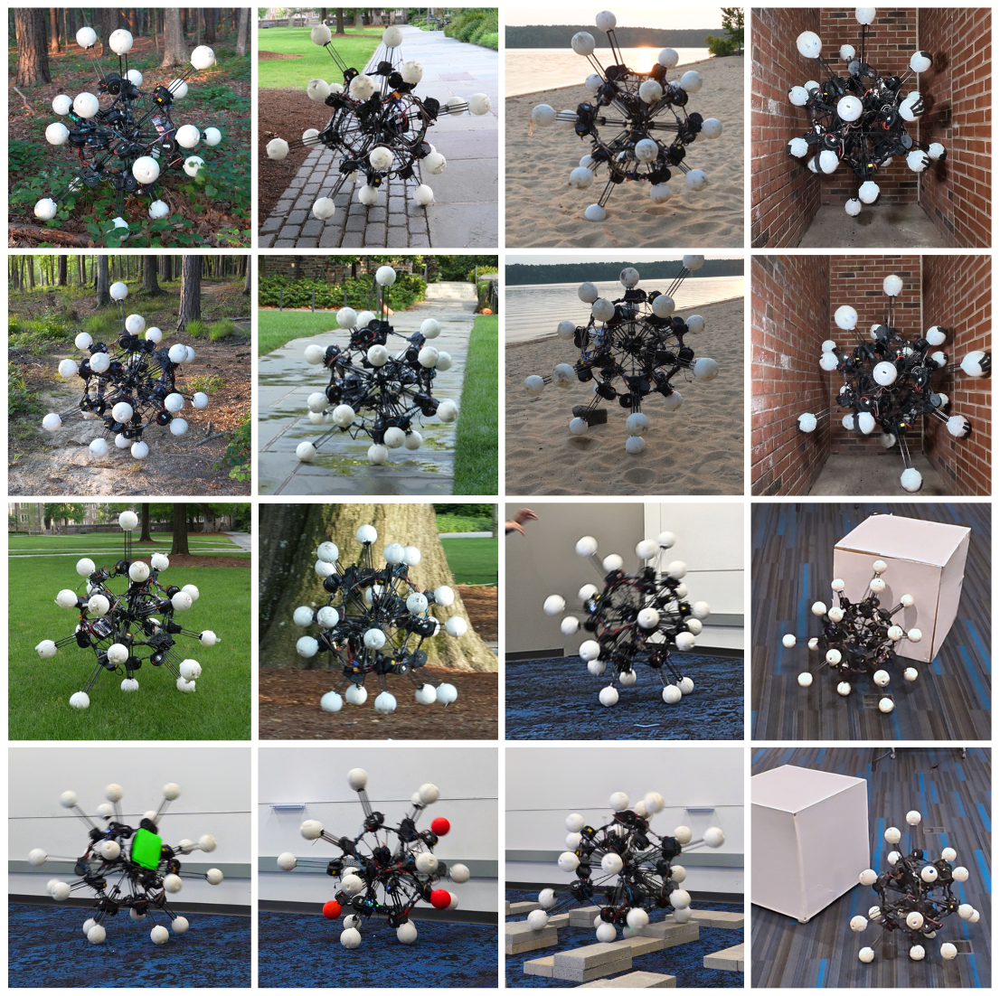

# Extreme Symmetry Enables Omnidirectional and Multifunctional Robotics
### Project Website: tbd

This repo includes the code for the Argus robot policy training.
<div align="left">
    
</div>

## Installation
Please install following packages.
```bash
conda create --name argus python=3.8
conda activate argus
pip install -r requirements.txt --no-cache-dir 

# install isaac gym
cd .. && git clone https://github.com/boxiXia/isaacgym.git && cd isaacgym/python && pip install -e .
```

## Quick Start
Run following checkpoint to check how Argus moves!
### Flat ground rolling

```bash
cd ARGUS/envs
conda activate argus && export LD_LIBRARY_PATH=${CONDA_PREFIX}/lib

bash run.sh argus_base -pk
```

🎮 Keyboard Controls  
- ⬆️ `i` → forward (+0.05m/s)  
- ⬇️ `k` → backward (-0.05m/s)  
- ⬅️ `j` → left (+0.05m/s)  
- ➡️ `l` → right (-0.05m/s)  
---
### Object interaction
Object pushing: `bash run.sh argus_object_pushing_IL -p` \
Object tracking: `bash run.sh argus_object_tracking_IL -p` 

Object pushing rendering:
<div align="left">
    
</div>

## Training Instructions
All training command can be found in envs/[README.md](envs/README.md)


## Project structure
```
.
├── assets/                # Pretrained models and robot descriptions
│   ├── checkpoint/
│   └── urdf/
├── envs/                  # Training and environment code
│   ├── cfg/               # Configs
│   ├── common/            # Shared utilities
│   ├── tasks/             # Task definitions
│   ├── runs/              # Training / evaluation logs
│   ├── utils/             # Helper scripts
│   ├── setup/             # Conda environment file
│   ├── train.py           # Training entry point
│   ├── run.sh / exp.sh    # Scripts for training & running experiments
│   ├── ppo_isaacgym.py    # PPO algorithm (Isaac Gym backend)
│   └── README.md          # Training instructions
│
├── visualization/         # Images and demo videos
├── requirements.txt       # Dependencies
└── README.md
```


## BibTeX

If you find our paper or codebase helpful, please consider citing:


## Acknowledgement
`This work is supported by DARPA FoundSci program under award HR00112490372, DARPA TIAMAT program under award HR00112490419, ARO under award W911NF2410405, ARL STRONG program under awards W911NF2320182, W911NF2220113, and W911NF242021, and by gift supports from BMW.`
