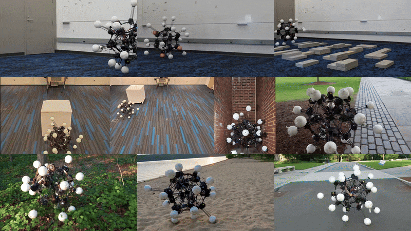
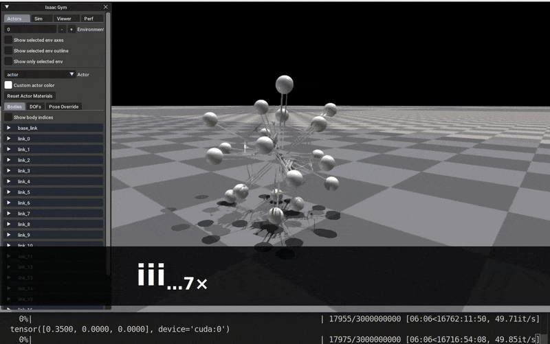
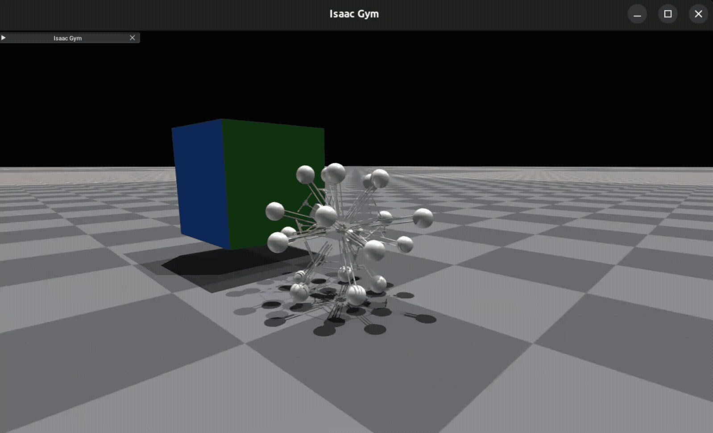

# Extreme Symmetry Enables Omnidirectional and Multifunctional Robotics

### [Jiaxun Liu*](https://jiaxunliu.com), [Boxi Xia*](https://scholar.google.com/citations?user=TjA61pwAAAAJ), [Boyuan Chen](http://boyuanchen.com/) 
Duke University    
*Equal contribution

### [Project Website](http://generalroboticslab.com/Argus-v1) | [Paper](#TBD) | [Video](#TBD) 

<div align="left">
    
</div>

## Installation
Please install following packages.
```bash
conda create --name argus python=3.8
conda activate argus
pip install -r requirements.txt --no-cache-dir 

# install isaac gym
cd .. && git clone https://github.com/boxiXia/isaacgym.git && cd isaacgym/python && pip install -e .
```

## Quick Start
Run following checkpoint to check how Argus moves!
### Flat ground rolling

```bash
cd ARGUS/envs
conda activate argus && export LD_LIBRARY_PATH=${CONDA_PREFIX}/lib

bash run.sh argus_base -pk # with keyboard control
bash run.sh argus_base -p # without keyboard control

```

🎮 Keyboard Controls  
- ⬆️ `i` → forward (+0.05m/s)  
- ⬇️ `k` → backward (-0.05m/s)  
- ⬅️ `j` → left (+0.05m/s)  
- ➡️ `l` → right (-0.05m/s) 


Once setup and running you will see:
<div align="left">
    
</div>


### Object interaction
Object pushing: `bash run.sh argus_object_pushing_IL -p` \
Object tracking: `bash run.sh argus_object_tracking_IL -p` 

Once setup and running you will see: \
Object pushing demo
<div align="left">
    
</div>
Object tracking demo
<div align="left">
    
</div>


## Training Instructions
All training command can be found in [envs/README.md](envs/README.md)

## Blender rendering

Detailed instruction can be found in [blender_rendering/README.md](blender_rendering/README.md)
<div align="left">
    
</div>

## Project structure
```
.
├── assets/                # Pretrained models and robot descriptions
│   ├── checkpoint/
│   └── urdf/
├── envs/                  # Training and environment code
│   ├── cfg/               # Configs
│   ├── common/            # Shared utilities
│   ├── tasks/             # Task definitions
│   ├── runs/              # Training / evaluation logs
│   ├── utils/             # Helper scripts
│   ├── setup/             # Conda environment file
│   ├── train.py           # Training entry point
│   ├── run.sh / exp.sh    # Scripts for training & running experiments
│   ├── ppo_isaacgym.py    # PPO algorithm (Isaac Gym backend)
│   └── README.md          # Training instructions
│
├── visualization/         # Images and demo videos
├── blender_rendering/     # rendering instruction
├── requirements.txt       # Dependencies
└── README.md
```


## BibTeX

If you find our paper or codebase helpful, please consider citing:
```
@misc{xxx,
      title={Extreme Symmetry Enables Omnidirectional and Multifunctional Robotics}, 
      author={Jiaxun Liu and Boxi Xia and Boyuan Chen},
      year={2025},
      eprint={TODO},
      archivePrefix={arXiv},
      primaryClass={cs.RO},
      url={https://arxiv.org/abs/TODO}, 
}
```

## Acknowledgement
This work is supported by DARPA FoundSci program under award HR00112490372, DARPA TIAMAT program under award HR00112490419, ARO under award W911NF2410405, ARL STRONG program under awards W911NF2320182, W911NF2220113, and W911NF242021, and by gift supports from BMW.
