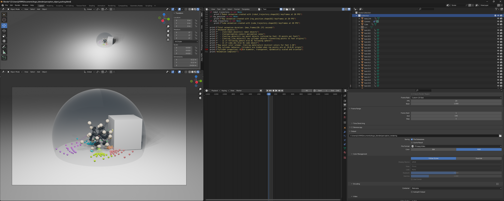
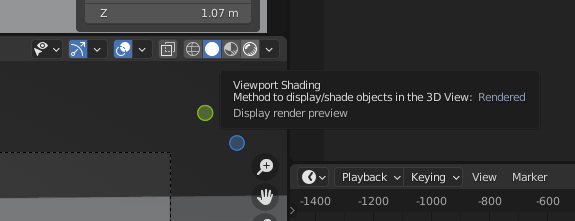
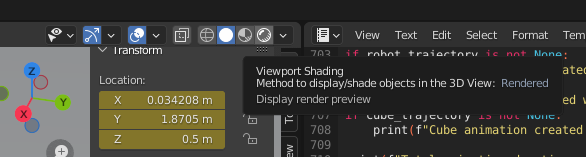
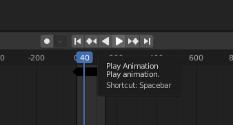
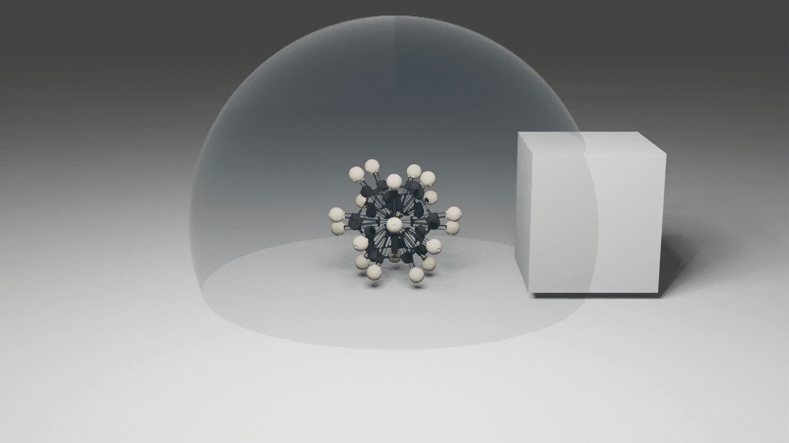

# Blender rendering instruction

Please download the blender file from [here](https://drive.google.com/drive/folders/1OIzNFc4BLMO4p8IIS8wud3FVtw9b3A39?usp=sharing).

## Design interface

    

## Step 1: turn on the Viewport Shading 

    

    

## Step 2: play the animation

    

Provided sequence of animation: 

    

